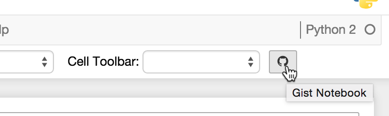

Gist it
=======

Publish the open notebook as a GitHub gist with one click, and update that gist on later clicks.




Setup
-----

The Jupyter server publishes through the [GitHub CLI](https://cli.github.com/), as whichever
account `gh` is logged in to on the machine that runs the server. The browser never sees a token.
Install `gh` there and log in once:

```
gh auth login
```

`gh auth login` asks for the `gist` scope by default. A login made without it can add it with
`gh auth refresh -s gist`.

The dialog names the account it publishes as. When `gh` is missing or logged out, the dialog says
so and publishing fails with that message.

To publish to GitHub Enterprise, set `GH_HOST` to the Enterprise host in the environment the
Jupyter server starts in, and log in to that host with `gh auth login --hostname`.


Publishing
----------

The first click creates a gist. gist_it saves its id in the notebook metadata and marks the
notebook as changed, so save it to keep the id. Later clicks update that gist. To publish to a
different gist, change the id in the dialog, or clear it to create a new one.

The dialog checks the id as you type and says whether the gist will be updated. A gist created as
private stays private, because GitHub does not change a gist's visibility on update.


Settings
--------

The one setting goes in the notebook section of nbconfig, `~/.jupyter/nbconfig/notebook.json`.

| setting | default | meaning |
|---|---|---|
| `gist_it_default_to_public` | `false` | whether a new gist is public unless unchecked in the dialog |
